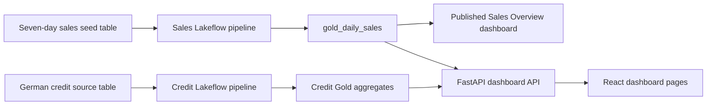

# SinghInt LLC: React, FastAPI, and Databricks Replication Guide

This runbook documents the project setup from an empty directory through the local React/FastAPI app, Databricks pipelines, SQL source table, and published Lakeview Sales Overview dashboard. It also records the workspace-specific commands used for this deployment. Replace workspace IDs, URLs, catalog/schema names, source tables, and dashboard IDs when reproducing it elsewhere. Never copy an access token into this file, React code, shell history, or Git.

## 1. What This Builds



The Sales Overview UI and the Databricks Sales dashboard use the same seven daily values. The credit pipeline aggregates the existing `german_credit_data` table by stated purpose and duration. The analysis is descriptive of historical labels, not a credit score or lending recommendation.

## 2. Repository Layout

```text
project-root/
  client/                         React 19 + Vite frontend
    src/App.jsx                   Hash navigation and Sales Overview page
    src/CreditAnalysis.jsx        Credit analysis page and API client
    src/App.css                   Dashboard and responsive page styles
    src/index.css                 Global styles and design tokens
    vite.config.js                /api proxy to FastAPI
  backend_server/
    app/main.py                   FastAPI routes and CORS
    app/settings.py               Environment-backed settings
    app/dashboard.py              Sales demo and Databricks SQL provider
    app/credit_analysis.py        Credit demo and Databricks SQL provider
    tests/test_main.py            API contract tests
    requirements.txt
    .env.example
  databrick/
    databricks.yml                Databricks Asset Bundle
    resources/sales_pipeline.yml  Sales and credit pipeline resources
    seed_sales.sql                Safe, idempotent source-table seed
    src/pipeline.py               Sales Bronze/Silver/Gold pipeline
    src/credit_pipeline.py        Credit Bronze/Silver/Gold pipeline
  README.md
  REPLICATION_GUIDE.md
  .gitignore
```

## 3. Prerequisites

- Node.js supported by the installed Vite version and npm
- Python 3.10 or newer; the implementation was tested with Python 3.14
- A Databricks workspace with Unity Catalog, a SQL warehouse, and Lakeflow pipeline permissions
- `curl`, `unzip`, and `jq` for the CLI installation/API examples below
- Databricks SQL access entitlement to create and publish Lakeview dashboards

Check local versions:

```sh
node --version
npm --version
python3 --version
jq --version
```

## 4. Create the Project Folders

Run these commands from the parent directory where the project should live:

```sh
mkdir -p Databrick_E2E_project/backend_server/app
mkdir -p Databrick_E2E_project/backend_server/tests
mkdir -p Databrick_E2E_project/databrick/resources
mkdir -p Databrick_E2E_project/databrick/src
cd Databrick_E2E_project
```

Create the React/Vite client and install its dependencies:

```sh
npm create vite@latest client -- --template react --no-interactive
npm --prefix client install
```

The generated React starter is replaced by the dashboard code in `client/src`. Keep the Vite `/api` proxy in `client/vite.config.js`; it sends development requests to `http://localhost:8000`.

The current implementation uses hash navigation:

- `http://localhost:5173/#overview` for Sales Overview
- `http://localhost:5173/#credit-analysis` for Credit Analysis

## 5. Set Up FastAPI

Create and activate the isolated environment, then install backend requirements:

```sh
cd backend_server
python3 -m venv .venv
source .venv/bin/activate
python -m pip install -r requirements.txt
cp .env.example .env
```

The API contract is:

- `GET /health`
- `GET /api/v1/dashboard?days=7` returns a summary and daily sales series. `days` must be between 1 and 90.
- `GET /api/v1/credit-analysis` returns overall counts, historical bad-label rate, average credit amount/duration, and breakdowns by purpose and duration.

`DATA_SOURCE=demo` is the default so the app works without Databricks credentials. For live SQL-backed API responses, configure the private `backend_server/.env` as described in section 7 and set `DATA_SOURCE=databricks`. Restart Uvicorn after changing it.

Run the API:

```sh
cd backend_server
.venv/bin/uvicorn app.main:app --reload --host 127.0.0.1 --port 8000
```

Run its tests:

```sh
cd backend_server
.venv/bin/python -m pytest -q
```

## 6. Prepare Databricks Access and CLI

### Workspace values used here

| Setting | Value |
| --- | --- |
| Workspace host | `https://dbc-05835634-9c28.cloud.databricks.com` |
| Workspace identifier | `aws:us-east-2:e2b7f0e7-1acb-4276-8c00-72bdc52c5bbf` |
| Workspace organization query value | `2163847751496363` |
| SQL warehouse | `Serverless Starter Warehouse` |
| SQL warehouse ID | `3a4041986a3b0bce` |
| SQL HTTP path | `/sql/1.0/warehouses/3a4041986a3b0bce` |
| Default catalog/schema | `workspace.default` |

The workspace identifier is not the host URL or SQL HTTP path. In another workspace, get the host from the browser address bar, the SQL HTTP path from the warehouse connection details, and the warehouse ID with the CLI.

### Install the official CLI on macOS

The unqualified `brew install databricks` command did not find a formula. The Databricks tap is the official Homebrew source:

```sh
brew tap databricks/tap
brew tap-info databricks/tap
brew trust --formula databricks/tap/databricks
brew install databricks/tap/databricks
```

On this machine, Homebrew could not build because the Apple Command Line Tools were outdated. Do not remove or replace system tools without approval. The official prebuilt release binary was installed to the user directory instead:

```sh
mkdir -p "$HOME/.local/bin" /tmp/databricks-cli-install
curl -fsSL "https://github.com/databricks/cli/releases/download/v1.19.0/databricks_cli_1.19.0_darwin_arm64.zip" -o /tmp/databricks-cli.zip
unzip -o -q /tmp/databricks-cli.zip -d /tmp/databricks-cli-install
install -m 755 /tmp/databricks-cli-install/databricks "$HOME/.local/bin/databricks"
"$HOME/.local/bin/databricks" -v
```

Use the official release page to select the current version and correct OS/architecture for another machine. Add `$HOME/.local/bin` to `PATH` if desired, or keep using the full executable path shown here.

Authenticate with browser-based OAuth. This stores the CLI profile locally; it does not put a token in the repository:

```sh
"$HOME/.local/bin/databricks" auth login \
  --host https://dbc-05835634-9c28.cloud.databricks.com \
  --profile fieldnote-workspace
```

For subsequent commands in this guide:

```sh
export DATABRICKS_CONFIG_PROFILE=fieldnote-workspace
export DATABRICKS_BUNDLE_ROOT="$PWD/databrick"
```

If you open a new terminal, repeat the `export` commands. The profile name is local CLI configuration, not a project secret.

Find the warehouse ID in another workspace:

```sh
"$HOME/.local/bin/databricks" warehouses list -o json \
  | jq '.[] | {id, name, state}'
```

## 7. Configure the FastAPI `.env`

Copy the example if you have not already:

```sh
cp backend_server/.env.example backend_server/.env
```

For the current workspace, the non-secret settings are:

```dotenv
DATA_SOURCE=databricks
FRONTEND_ORIGIN=http://localhost:5173
DATABRICKS_WORKSPACE_ID=aws:us-east-2:e2b7f0e7-1acb-4276-8c00-72bdc52c5bbf
DATABRICKS_SERVER_HOSTNAME=dbc-05835634-9c28.cloud.databricks.com
DATABRICKS_HTTP_PATH=/sql/1.0/warehouses/3a4041986a3b0bce
DATABRICKS_ACCESS_TOKEN=REPLACE_WITH_A_SECRET
DATABRICKS_GOLD_TABLE=workspace.default.gold_daily_sales
DATABRICKS_CREDIT_SUMMARY_TABLE=workspace.default.gold_credit_summary
DATABRICKS_CREDIT_PURPOSE_TABLE=workspace.default.gold_credit_by_purpose
DATABRICKS_CREDIT_DURATION_TABLE=workspace.default.gold_credit_by_duration
```

Create a Databricks access token through your workspace's approved credential process and enter it directly into `backend_server/.env`. Never paste it into chat, a source file, or a shell command; never commit `.env`. `.gitignore` excludes it. The workspace ID setting is informational; the SQL connector uses the hostname, HTTP path, and access token.

The API uses the Databricks SQL Connector to read Gold tables. It does not use the CLI's OAuth profile as a SQL connector credential. If your organization does not permit personal access tokens, implement an approved service-principal or OAuth credential provider rather than copying CLI tokens.

## 8. Seed the Sales Source Table

`databrick/seed_sales.sql` creates the source table without replacing an existing object. Run the file in the Databricks SQL Editor with the Serverless Starter Warehouse selected:

```sql
CREATE TABLE IF NOT EXISTS workspace.default.fieldnote_sales_source AS
SELECT
  date_sub(current_date(), CAST(day_offset AS INT)) AS order_date,
  CAST(revenue AS DECIMAL(18, 2)) AS revenue,
  CAST(order_count AS INT) AS order_count,
  CAST(customer_count AS INT) AS customer_count
FROM VALUES
  (6, 1840.0, 18, 18),
  (5, 2360.0, 23, 23),
  (4, 1980.0, 20, 20),
  (3, 3120.0, 29, 29),
  (2, 2750.0, 26, 26),
  (1, 3580.0, 34, 34),
  (0, 4210.0, 39, 39)
AS sales(day_offset, revenue, order_count, customer_count);
```

Those values match the React demo: `$19,840` total revenue and 189 orders. Dates are generated relative to `current_date()`. Because the statement is `IF NOT EXISTS`, it does not reseed an existing table; only drop/recreate this specifically owned demo table if you intentionally need fresh dates.

The same table was created through the SQL Statement Execution API with this command. This is optional; running the checked-in SQL in the UI is simpler:

```sh
statement="CREATE TABLE IF NOT EXISTS workspace.default.fieldnote_sales_source AS SELECT date_sub(current_date(), CAST(day_offset AS INT)) AS order_date, CAST(revenue AS DECIMAL(18, 2)) AS revenue, CAST(order_count AS INT) AS order_count, CAST(customer_count AS INT) AS customer_count FROM VALUES (6, 1840.0, 18, 18), (5, 2360.0, 23, 23), (4, 1980.0, 20, 20), (3, 3120.0, 29, 29), (2, 2750.0, 26, 26), (1, 3580.0, 34, 34), (0, 4210.0, 39, 39) AS sales(day_offset, revenue, order_count, customer_count)"
request=$(jq -nc --arg warehouse_id 3a4041986a3b0bce --arg statement "$statement" '{warehouse_id: $warehouse_id, statement: $statement, wait_timeout: "50s", on_wait_timeout: "CONTINUE"}')
"$HOME/.local/bin/databricks" api post /api/2.0/sql/statements --json "$request" -o json
```

## 9. Deploy and Run the Lakeflow Pipelines

The bundle is `databrick/databricks.yml`; its resources live in `databrick/resources/sales_pipeline.yml`. It creates:

- `sales_pipeline`: `fieldnote_sales_source` to `bronze_orders`, `silver_orders`, and `gold_daily_sales`.
- `credit_pipeline`: `german_credit_data` to `bronze_credit_applications`, `silver_credit_applications`, `gold_credit_summary`, `gold_credit_by_purpose`, and `gold_credit_by_duration`.

Run from the repository root:

```sh
export DATABRICKS_CONFIG_PROFILE=fieldnote-workspace
export DATABRICKS_BUNDLE_ROOT="$PWD/databrick"
"$HOME/.local/bin/databricks" bundle validate -t dev
"$HOME/.local/bin/databricks" bundle deploy -t dev
"$HOME/.local/bin/databricks" bundle run sales_pipeline -t dev
"$HOME/.local/bin/databricks" bundle run credit_pipeline -t dev
```

Validation, deployment, and each pipeline run are separate commands so you can see which step failed. The sales pipeline expects its source to have `order_date`, `revenue`, `order_count`, and `customer_count`. Change `source_table` in `databrick/databricks.yml` if using another normalized source.

The credit source is `workspace.default.german_credit_data`, with fields `Age`, `Sex`, `Job`, `Housing`, `Saving accounts`, `Checking account`, `Credit amount`, `Duration`, `Purpose`, and `Risk`. The Bronze table aliases spaced column names to Delta-safe snake case. Silver and Gold deliberately omit age/sex from the analysis outputs.

Check an update by using the pipeline/update IDs printed by `bundle run`:

```sh
"$HOME/.local/bin/databricks" pipelines get-update PIPELINE_ID UPDATE_ID -o json \
  | jq '.update | {state, cause}'
```

If an update fails, inspect its pipeline event log. The German credit failure was diagnosed this way:

```sh
export CREDIT_PIPELINE_ID=bb06e552-a0e1-4cfe-bafd-813f1413f775
"$HOME/.local/bin/databricks" pipelines list-pipeline-events "$CREDIT_PIPELINE_ID" \
  --max-results 30 -o json \
  | jq '.[0].error.exceptions[]? | {class_name, message}'
```

The CLI can also emit its current bundle JSON Schema when resource fields need verification:

```sh
"$HOME/.local/bin/databricks" bundle schema --output json
```

Current workspace runs completed for both pipelines. The final successful run IDs were:

| Pipeline | Pipeline ID | Completed update ID |
| --- | --- | --- |
| Sales | `93468fab-75cc-4170-9e46-f81afd145387` | `1a73365a-e1f6-4938-95a2-11ee088a1d73` |
| Credit | `bb06e552-a0e1-4cfe-bafd-813f1413f775` | `c315ec11-fae1-48de-81b9-419c86725271` |

## 10. Create and Publish a Lakeview Sales Dashboard

The German-credit dashboard was retained. The Sales Overview dashboard is a separate dashboard that reads `workspace.default.gold_daily_sales`. The commands below show how it was created by reusing the existing dashboard's supported serialized format and replacing its dataset/widget content.

Set the source dashboard and warehouse IDs for this workspace:

```sh
export CREDIT_DASHBOARD_ID=01f0ba058c991cebad5b931a7d75fe67
export SALES_WAREHOUSE_ID=3a4041986a3b0bce
```

Inspect a dashboard or list dashboards:

```sh
"$HOME/.local/bin/databricks" lakeview list -o json
"$HOME/.local/bin/databricks" lakeview get "$CREDIT_DASHBOARD_ID" -o json \
  | jq -r '.serialized_dashboard'
```

Create a separate Sales Overview draft. This command keeps the existing dashboard unchanged, reuses its table/text widget format, and points the dataset at the sales Gold table:

```sh
serialized_dashboard=$(
  "$HOME/.local/bin/databricks" lakeview get "$CREDIT_DASHBOARD_ID" -o json \
    | jq -r '.serialized_dashboard' \
    | jq -c '
      . as $root
      | ($root.pages[0].layout[] | select(.widget.name == "table1").widget) as $table
      | ($root.pages[0].layout[] | select(.widget.name == "text_box1").widget) as $note
      | $root
      | .datasets = [{
          name: "sales_daily",
          displayName: "Daily sales",
          queryLines: ["SELECT order_date, revenue, order_count, customer_count FROM workspace.default.gold_daily_sales ORDER BY order_date"]
        }]
      | .pages = [{
          name: "sales_page",
          displayName: "Sales overview",
          pageType: "PAGE_TYPE_CANVAS",
          layout: [
            {
              widget: ($note
                | .name = "sales_intro"
                | .multilineTextboxSpec.lines = ["# Sales overview\n", "Daily orders and revenue from the Databricks Gold pipeline.\n"]),
              position: {x: 0, y: 0, width: 6, height: 2}
            },
            {
              widget: ($table
                | .name = "sales_daily_table"
                | .queries[0].query = {
                    datasetName: "sales_daily",
                    fields: [
                      {name: "order_date", expression: "`order_date`"},
                      {name: "revenue", expression: "`revenue`"},
                      {name: "order_count", expression: "`order_count`"},
                      {name: "customer_count", expression: "`customer_count`"}
                    ],
                    disaggregated: true
                  }
                | .spec.encodings.columns = [
                    (.spec.encodings.columns[0] | .fieldName = "order_date" | .type = "date" | .displayAs = "date" | .title = "Order date"),
                    (.spec.encodings.columns[1] | .fieldName = "revenue" | .type = "decimal" | .displayAs = "number" | .numberFormat = "$#,##0.00" | .title = "Revenue"),
                    (.spec.encodings.columns[2] | .fieldName = "order_count" | .type = "integer" | .displayAs = "number" | .title = "Orders"),
                    (.spec.encodings.columns[3] | .fieldName = "customer_count" | .type = "integer" | .displayAs = "number" | .title = "Customers")
                  ]),
              position: {x: 0, y: 2, width: 6, height: 6}
            }
          ]
        }]
    '
)

"$HOME/.local/bin/databricks" lakeview create \
  --display-name "Sales Overview" \
  --warehouse-id "$SALES_WAREHOUSE_ID" \
  --dataset-catalog workspace \
  --dataset-schema default \
  --serialized-dashboard "$serialized_dashboard" \
  -o json
```

Save the `dashboard_id` returned by `lakeview create`, then publish without embedding personal credentials:

```sh
export SALES_DASHBOARD_ID=01f1bda6e8ef1597b2dbd26bc573ade4
"$HOME/.local/bin/databricks" lakeview publish "$SALES_DASHBOARD_ID" \
  --warehouse-id "$SALES_WAREHOUSE_ID" -o json
"$HOME/.local/bin/databricks" lakeview get-published "$SALES_DASHBOARD_ID" -o json
```

The date was initially not visible in the table, so the dataset was changed to cast it to a string, then the dashboard was republished. This is the exact update command used:

```sh
serialized_dashboard=$(
  "$HOME/.local/bin/databricks" lakeview get "$SALES_DASHBOARD_ID" -o json \
    | jq -r '.serialized_dashboard' \
    | jq -c '
      .datasets[0].queryLines = ["SELECT CAST(order_date AS STRING) AS order_date, revenue, order_count, customer_count FROM workspace.default.gold_daily_sales ORDER BY order_date"]
      | .pages[0].layout |= map(
          if .widget.name == "sales_daily_table" then
            (.widget.spec.encodings.columns[0].type = "string"
              | .widget.spec.encodings.columns[0].displayAs = "string"
              | .widget.spec.encodings.columns[0].alignContent = "left"
              | .widget.spec.encodings.columns[0] |= del(.numberFormat))
          else . end
        )
    '
)

"$HOME/.local/bin/databricks" lakeview update "$SALES_DASHBOARD_ID" \
  --dataset-catalog workspace \
  --dataset-schema default \
  --warehouse-id "$SALES_WAREHOUSE_ID" \
  --serialized-dashboard "$serialized_dashboard" \
  -o json
"$HOME/.local/bin/databricks" lakeview publish "$SALES_DASHBOARD_ID" \
  --warehouse-id "$SALES_WAREHOUSE_ID" -o json
```

Current published dashboards:

- [Sales Overview](https://dbc-05835634-9c28.cloud.databricks.com/dashboardsv3/01f1bda6e8ef1597b2dbd26bc573ade4/published?o=2163847751496363)
- [German credit dashboard](https://dbc-05835634-9c28.cloud.databricks.com/sql/dashboardsv3/01f0ba058c991cebad5b931a7d75fe67?o=2163847751496363)

The SQL warehouse is stopped after checks to avoid leaving serverless compute running. Opening or refreshing a dashboard starts its selected warehouse. Free Edition may limit concurrent serverless workloads.

## 11. Run the Local Frontend

Use separate terminals:

Terminal 1, backend:

```sh
cd backend_server
.venv/bin/uvicorn app.main:app --reload --host 127.0.0.1 --port 8000
```

Terminal 2, frontend:

```sh
npm --prefix client run dev -- --host 127.0.0.1
```

Open `http://127.0.0.1:5173/`. Vite proxies `/api` to FastAPI. Test routes directly:

```sh
curl http://127.0.0.1:8000/health
curl 'http://127.0.0.1:8000/api/v1/dashboard?days=7'
curl http://127.0.0.1:8000/api/v1/credit-analysis
```

When `DATA_SOURCE=demo`, both pages use deterministic local demo datasets. When `DATA_SOURCE=databricks`, FastAPI queries the configured Gold tables. The Databricks SQL warehouse must be running for SQL-backed API/dashboard queries.

## 12. Validate the Whole Project

```sh
cd backend_server
.venv/bin/python -m pytest -q
cd ..
npm --prefix client run lint
npm --prefix client run build
cd databrick
DATABRICKS_CONFIG_PROFILE=fieldnote-workspace \
  "$HOME/.local/bin/databricks" bundle validate -t dev
```

The implemented checks passed: 4 FastAPI tests, Oxlint, Vite production build, Python/YAML syntax parsing, and authenticated Databricks bundle validation. Pipeline runs completed in the workspace.

## 13. Troubleshooting and Fixes from This Build

### Databricks CLI installation

- `brew install databricks` alone did not find a formula. Add and verify `databricks/tap` first.
- Homebrew required an explicit trust for the Databricks formula, then its build was blocked by outdated Apple Command Line Tools. The official prebuilt release archive avoided changing system developer tools.
- The binary was installed in `$HOME/.local/bin`, which may not be on `PATH`; use the full path or add it to your shell `PATH`.

### Bundle notebook recognition

Bundle validation requires Python pipeline files to be recognized as Databricks source notebooks. Both `databrick/src/pipeline.py` and `databrick/src/credit_pipeline.py` start with:

```python
# Databricks notebook source
```

### German credit Delta column names

The source contains names such as `Saving accounts` and `Credit amount`. Writing these unchanged to a Delta Bronze table failed with `DELTA_INVALID_CHARACTERS_IN_COLUMN_NAMES`. The Bronze function now aliases all fields to safe snake case. Silver/Gold omit age and sex.

### Free Edition compute quota

The sales rerun initially failed with `RESOURCE_EXHAUSTED` while the SQL warehouse was also running. Stop the warehouse to free capacity, then retry the pipeline:

```sh
DATABRICKS_CONFIG_PROFILE=fieldnote-workspace \
  "$HOME/.local/bin/databricks" warehouses get 3a4041986a3b0bce -o json \
  | jq '{name, state, num_clusters}'
DATABRICKS_CONFIG_PROFILE=fieldnote-workspace \
  "$HOME/.local/bin/databricks" warehouses stop 3a4041986a3b0bce
DATABRICKS_CONFIG_PROFILE=fieldnote-workspace \
  "$HOME/.local/bin/databricks" bundle run sales_pipeline -t dev
```

### Bundle validation location

Run `bundle` commands from `databrick/`, or set `DATABRICKS_BUNDLE_ROOT` to that directory. Running from `backend_server/` without setting the bundle root produces a "databricks.yml not found" error.

### Credentials and local files

- Never commit `backend_server/.env`; only `.env.example` belongs in Git.
- Do not embed credentials in a published Lakeview dashboard unless explicitly required.
- The workspace OAuth profile lives in user-level Databricks CLI config, not the repository.
- This project had an untracked `profilesetup.txt` during the original setup. It was left untouched; inspect it locally and do not commit it if it contains profile/credential material.

## 14. Workspace-Specific IDs

These IDs are provided to make the existing deployment inspectable; use newly returned IDs in another workspace:

| Resource | ID / name |
| --- | --- |
| Databricks CLI profile | `fieldnote-workspace` |
| Sales pipeline | `93468fab-75cc-4170-9e46-f81afd145387` |
| Credit pipeline | `bb06e552-a0e1-4cfe-bafd-813f1413f775` |
| Sales dashboard | `01f1bda6e8ef1597b2dbd26bc573ade4` |
| Existing German credit dashboard | `01f0ba058c991cebad5b931a7d75fe67` |
| SQL warehouse | `3a4041986a3b0bce` |

Do not reuse these IDs as credentials or assume they will exist in another workspace.

The current bundle name, CLI profile, and `fieldnote_sales_source` table are stable identifiers already used by the deployed workspace resources. They are intentionally retained during this visual brand rename; changing them requires a separately planned Databricks resource/table migration.

## 15. Troubleshooting Commands from `profilesetup.txt`

These are the useful workspace checks collected during the original profile setup. Set `DATABRICKS_CONFIG_PROFILE=fieldnote-workspace` in the current shell first. Replace the sample IDs with IDs returned by your own workspace.

Inspect available Lakeview options and list dashboards:

```sh
"$HOME/.local/bin/databricks" lakeview --help
"$HOME/.local/bin/databricks" lakeview create --help
"$HOME/.local/bin/databricks" lakeview publish --help
"$HOME/.local/bin/databricks" lakeview list -o json
```

Inspect the source dashboard or verify the Sales dashboard publication:

```sh
"$HOME/.local/bin/databricks" lakeview get 01f0ba058c991cebad5b931a7d75fe67 -o json \
  | jq '{display_name, warehouse_id, serialized_dashboard}'
"$HOME/.local/bin/databricks" lakeview get 01f1bda6e8ef1597b2dbd26bc573ade4 -o json \
  | jq -r '.serialized_dashboard'
"$HOME/.local/bin/databricks" lakeview get-published 01f1bda6e8ef1597b2dbd26bc573ade4 -o json \
  | jq '{display_name, warehouse_id, embed_credentials}'
```

Check pipeline update state, inspect detailed failures, and list workspaces' warehouses:

```sh
"$HOME/.local/bin/databricks" pipelines get-update PIPELINE_ID UPDATE_ID -o json \
  | jq '.update | {state, cause}'
"$HOME/.local/bin/databricks" pipelines list-pipeline-events PIPELINE_ID \
  --max-results 30 -o json \
  | jq '.[]? | .error.exceptions[]? | {class_name, message}'
"$HOME/.local/bin/databricks" warehouses list -o json \
  | jq 'if type == "array" then map({id, name, state}) else . end'
```

If Free Edition reports serverless `RESOURCE_EXHAUSTED`, inspect and stop the SQL warehouse before retrying a pipeline. Stopping the warehouse may pause dashboard refreshes until it is started again.

```sh
"$HOME/.local/bin/databricks" warehouses get 3a4041986a3b0bce -o json \
  | jq '{name, state, num_clusters}'
"$HOME/.local/bin/databricks" warehouses stop 3a4041986a3b0bce
"$HOME/.local/bin/databricks" bundle run sales_pipeline -t dev
```

The original `profilesetup.txt` is a workspace-local command log and is not part of the replication guide. It was left unchanged; review it locally before committing if it contains workspace-specific material.